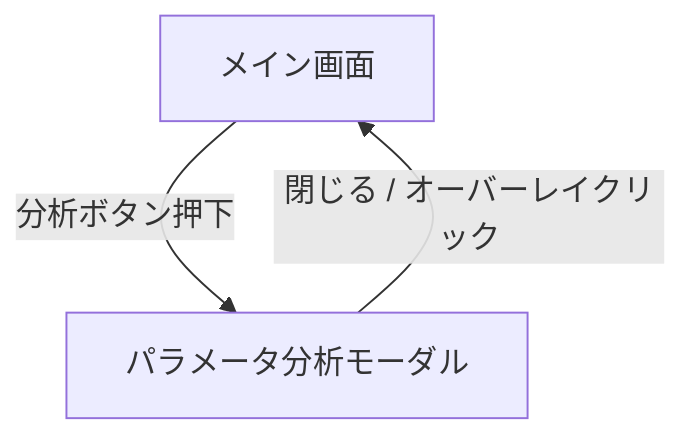

# UI 仕様

## 画面一覧

| 画面 | パス | 概要 |
|------|------|------|
| メイン画面 | `/` | ファイルアップロード・統計・チャート・結果テーブルの統合画面 |
| パラメータ分析モーダル | （モーダル） | クエリのパラメータ値別分析 |

## 画面遷移図

## 画面機能仕様

### メイン画面

#### ファイルアップロードエリア

- 破線ボーダーのドロップゾーン
- ドラッグ中はボーダーが青色に変化し、背景が薄い青に変わる
- テキスト: 「📁 ファイルをドラッグ＆ドロップ」（ホバー時は「📁 ファイルをドロップしてください」）
- クリックでファイル選択ダイアログを開く
- 複数ファイル対応、全ファイル形式受付
- 解析中はスピナーと「解析中...」を表示

#### アップロード済みファイル一覧

- ファイルアップロード後に表示
- 見出し: 「アップロード済みファイル (N)」
- 各ファイル: ファイル名、サイズ (KB)、エントリ数、個別削除ボタン
- 「全て削除」ボタン

#### 統計サマリー（StatsSummary）

- 4 列のカード:
  - 青: 総クエリ数
  - 緑: 総実行時間
  - 黄: 平均実行時間
  - 赤: 最大実行時間
- 解析期間（開始日時、終了日時、期間日数）
- 検索効率（平均検査行数、最小実行時間）
- 最も遅いクエリの詳細（赤背景カード）

#### 時系列チャート（TimeSeriesChart）

- 見出し: 「スロークエリ実行時間の時系列変化」
- ファイルごとの表示/非表示トグルボタン（色付きドット）
- Chart.js 折れ線グラフ
  - X 軸: タイムスタンプ（「月 日 時:分」形式）
  - Y 軸: 実行時間（秒）、0 始まり
- ツールチップ: ファイル名、実行時間、ユーザー、検査行数、送信行数

#### 結果テーブル

- 見出し: 「クエリ解析結果」
- 複数ファイル時: 「N つのファイルを統合した結果を表示しています」
- テーブル列:
  1. 正規化クエリ（等幅フォント、100 文字で切り詰め）
  2. 実行回数（ソート可）
  3. 総実行時間（ソート可）
  4. 平均実行時間（ソート可）
  5. 最大実行時間（ソート可、赤字）
  6. 最小実行時間（ソート可、緑字）
  7. 分析ボタン
- デフォルトソート: 総実行時間 降順
- 上位 20 件表示
- ソートインジケータ: ↑ / ↓

### パラメータ分析モーダル（QueryAnalysisModal）

- 固定オーバーレイ（黒 50% 透過）
- 中央配置の白カード（最大幅 6xl、最大高さ 90vh、スクロール可）
- 見出し: 「クエリパラメータ分析」
- サブタイトル: 「総実行回数: N、パターン数: M」
- 正規化クエリ表示（等幅フォント）
- パラメータ値別分析テーブル:
  - 実際のクエリ（等幅、80 文字で切り詰め）
  - 実行回数（青バッジ）
  - 平均/最大/最小/合計実行時間
  - ソート: 実行回数降順 → 合計時間降順
- 「閉じる」ボタン、右上の × ボタン

## 表示状態

| 状態 | 表示内容 |
|------|---------|
| **Loading** | スピナー + 「解析中...」、ファイル入力は無効化 |
| **Empty** | アップロードエリアのみ表示、他のセクションは非表示 |
| **Error** | トースト通知（赤）、一部ファイル失敗時は警告通知（黄）で処理継続 |
| **データ表示** | 全セクション表示 |

## レイアウト構成

- ヘッダー: 「MySQL スロークエリ解析ツール」
- コンテンツ最大幅: `max-w-7xl`（80rem）
- 背景: `bg-gray-50`
- 通知: 画面右上に固定表示

## コンポーネント一覧

| コンポーネント | Props | 役割 |
|---------------|-------|------|
| `StatsSummary` | `entries: SlowQueryEntry[]` | 統計カード・期間・最遅クエリ表示 |
| `TimeSeriesChart` | `fileData: { name, entries }[]` | 時系列折れ線グラフ |
| `QueryAnalysisModal` | `isOpen, onClose, analysis` | パラメータ分析モーダル |
| `NotificationContainer` | `notifications[], onRemove` | 通知コンテナ |
| `NotificationToast` | `notification, onRemove` | 個別トースト通知 |

## UI 規約

- カラーパレット: Tailwind CSS デフォルト
- フォント: システムフォント（`next/font` の Geist Sans / Geist Mono）
- アイコン: SVG インライン
- アニメーション: Tailwind の `transition` ユーティリティ
- レスポンシブ: `sm:` / `md:` / `lg:` ブレークポイントで 2 列 → 4 列グリッド
