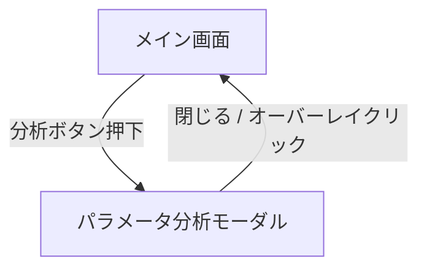

# UI 仕様

## デザインシステム

[aeru DESIGN.md](https://github.com/kzhrknt/awesome-design-md-jp/blob/main/design-md/aeru/DESIGN.md) に基づくデザインシステムを採用。

### カラーパレット

| トークン | 値 | 用途 |
|---------|-----|------|
| Vermillion（朱色） | `#c73120` | ブランドカラー。CTA ボタン、アクセント、ソートインジケータ |
| Vermillion Dark | `#a52819` | ホバー・プレス時 |
| Danger | `#c73120` | エラー表示、最大実行時間 |
| Warning | `#d97a00` | 警告、平均実行時間 |
| Success | `#2e7d4f` | 成功、最小実行時間 |
| Text Primary | `#262626` | 本文テキスト |
| Text Secondary | `#666666` | 補足テキスト |
| Border | `#dddddd` | 区切り線 |
| Background | `#ffffff` | カード背景 |
| Surface Warm | `#fbf9f7` | ページ背景、セクション背景 |
| Surface Footer | `#faf7f4` | フッター |
| Surface Deep | `#f7f2ed` | 強調セクション背景 |

### タイポグラフィ

| 要素 | フォント | サイズ | Weight | 行間 | 字間 | 備考 |
|------|---------|--------|--------|------|------|------|
| 本文 | body stack | 12.96px | 400 | 1.9 | 0.05em | — |
| リード文 | body stack | 14.688px | 400 | 2.2 | 0.05em | — |
| h2 見出し | body stack | 25px | 700 | 1.5 | 0.15em | `palt` |
| CTA ボタン | body stack | 12.96px | 700 | — | 0.1em | `palt`、pill |

フォントスタック: `"Helvetica Neue", Arial, "Hiragino Kaku Gothic ProN", "Hiragino Sans", Meiryo, sans-serif`

### ボタン

- CTA: `bg-vermillion` / `text-white` / `rounded-full`（pill）/ Weight 700 / `palt`
- タグ: `border border-vermillion` / `text-vermillion` / `rounded-full`（pill）
- 削除系: `text-vermillion` / `rounded-full`

### Depth

- Level 0: `none`（ほぼ全要素）
- Level 1: `0 2px 8px rgba(0,0,0,0.08)`（通知トースト）
- Level 2: `0 4px 16px rgba(0,0,0,0.1)`（モーダル）

## 画面一覧

| 画面 | パス | 概要 |
|------|------|------|
| メイン画面 | `/` | ファイルアップロード・統計・チャート・結果テーブルの統合画面 |
| パラメータ分析モーダル | （モーダル） | クエリのパラメータ値別分析 |

## 画面遷移図

## 画面機能仕様

### メイン画面

#### ファイルアップロードエリア

- 破線ボーダーのドロップゾーン
- ドラッグ中はボーダーが朱色に変化し、背景が Surface Deep に変わる
- テキスト: 「ファイルをドラッグ＆ドロップ」（ホバー時は「ファイルをドロップしてください」）
- クリックでファイル選択ダイアログを開く
- 複数ファイル対応、全ファイル形式受付
- 解析中はスピナーと「解析中...」を表示

#### アップロード済みファイル一覧

- ファイルアップロード後に表示
- 見出し: 「アップロード済みファイル (N)」
- 各ファイル: ファイル名、サイズ (KB)、エントリ数、個別削除ボタン
- 「全て削除」ボタン（朱色枠 pill）

#### 統計サマリー（StatsSummary）

- 4 列のカード（Surface Warm / Surface Deep 背景、フラット）:
  - 朱色: 総クエリ数
  - 朱色: 総実行時間
  - Warning: 平均実行時間
  - Danger: 最大実行時間
- 解析期間（開始日時、終了日時、期間日数）
- 検索効率（平均検査行数、最小実行時間）
- 最も遅いクエリの詳細（Surface Deep 背景）

#### 時系列チャート（TimeSeriesChart）

- 見出し: 「スロークエリ実行時間の時系列変化」
- ファイルごとの表示/非表示トグルボタン（pill、色付きドット）
- Chart.js 折れ線グラフ
  - X 軸: タイムスタンプ（「月 日 時:分」形式）
  - Y 軸: 実行時間（秒）、0 始まり
  - カラーパレット: 朱色・成功色・警告色・テキスト色系
- ツールチップ: ファイル名、実行時間、ユーザー、検査行数、送信行数

#### 結果テーブル

- 見出し: 「クエリ解析結果」
- 複数ファイル時: 「N つのファイルを統合した結果を表示しています」
- テーブル列:
  1. 正規化クエリ（等幅フォント、100 文字で切り詰め）
  2. 実行回数（ソート可）
  3. 総実行時間（ソート可）
  4. 平均実行時間（ソート可）
  5. 最大実行時間（ソート可、Danger 色）
  6. 最小実行時間（ソート可、Success 色）
  7. 分析ボタン（朱色 pill CTA）
- デフォルトソート: 総実行時間 降順
- 上位 20 件表示
- ソートインジケータ: ↑ / ↓（朱色）

### パラメータ分析モーダル（QueryAnalysisModal）

- 固定オーバーレイ（黒 50% 透過）
- 中央配置のカード（最大幅 6xl、最大高さ 90vh、スクロール可、Level 2 シャドウ）
- 見出し: 「クエリパラメータ分析」
- サブタイトル: 「総実行回数: N、パターン数: M」
- 正規化クエリ表示（等幅フォント）
- パラメータ値別分析テーブル:
  - 実際のクエリ（等幅、80 文字で切り詰め）
  - 実行回数（朱色枠 pill バッジ）
  - 平均/最大/最小/合計実行時間
  - ソート: 実行回数降順 → 合計時間降順
- 「閉じる」ボタン（朱色 pill CTA）、右上の × ボタン

## 表示状態

| 状態 | 表示内容 |
|------|---------|
| **Loading** | スピナー（朱色）+ 「解析中...」、ファイル入力は無効化 |
| **Empty** | アップロードエリアのみ表示、他のセクションは非表示 |
| **Error** | トースト通知（Danger 色ボーダー）、一部ファイル失敗時は警告通知（Warning 色ボーダー）で処理継続 |
| **データ表示** | 全セクション表示 |

## レイアウト構成

- ヘッダー: 「MySQL スロークエリ解析ツール」
- コンテンツ最大幅: 1100px
- ページ背景: Surface Warm (`#fbf9f7`)
- 通知: 画面右上に固定表示

## コンポーネント一覧

| コンポーネント | Props | 役割 |
|---------------|-------|------|
| `StatsSummary` | `entries: SlowQueryEntry[]` | 統計カード・期間・最遅クエリ表示 |
| `TimeSeriesChart` | `fileData: { name, entries }[]` | 時系列折れ線グラフ |
| `QueryAnalysisModal` | `isOpen, onClose, analysis` | パラメータ分析モーダル |
| `NotificationContainer` | `notifications[], onRemove` | 通知コンテナ |
| `NotificationToast` | `notification, onRemove` | 個別トースト通知 |

## UI 規約

- デザインシステム: aeru DESIGN.md 準拠
- カラーパレット: CSS カスタムプロパティで定義（Tailwind v4 `@theme inline`）
- フォント: Helvetica Neue 先頭の欧文優先フォントスタック
- アイコン: SVG インライン
- ボタン: 全て pill 型（`border-radius: 9999px`）
- 影: フラット運用が原則。面色の差で階層表現
- アニメーション: Tailwind の `transition` ユーティリティ
- レスポンシブ: `lg:` ブレークポイントで 2 列 → 4 列グリッド
